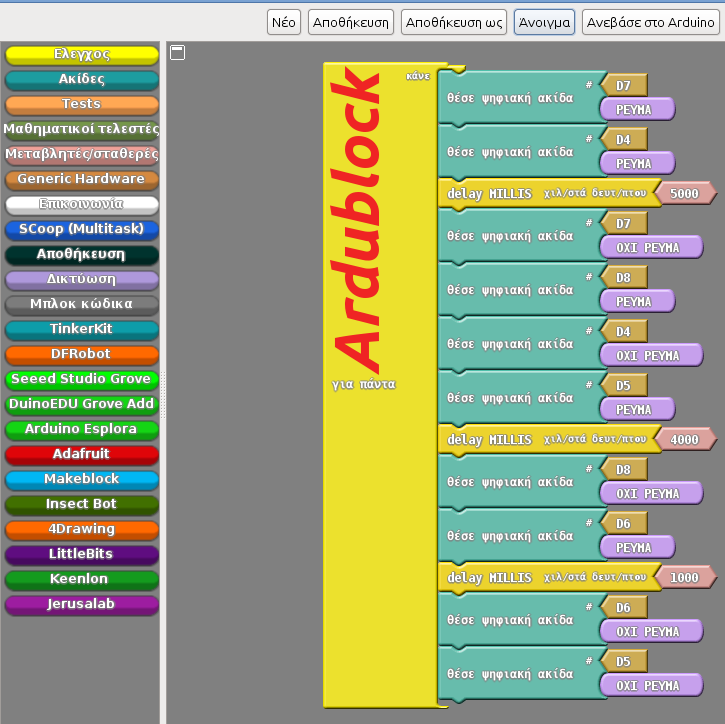

​
# Επανασχεδιάζοντας το φανάρι πεζών του σχολείου μας

## Το έργο μας αναλυτικά
Στο σχολείο μας φοιτούν περίπου 300 μαθητές και είναι ένα από τα μεγαλύτερα σχολεία της πόλης των Γιαννιτσών. Δυστυχώς όμως το φανάρι πεζών που βρίσκεται έξω από την κύρια είσοδο του σχολείου μας δεν λειτουργεί εδώ και χρόνια. Έτσι η διέλευση του δρόμου από τους μαθητές και τους συνοδούς τους κατά την προσέλευση αλλά και αποχώρηση από το σχολείο είναι επικίνδυνη.
Σκεφτήκαμε λοιπόν να δημιουργήσουμε μια μακέτα της διάβασης πεζών του σχολείου μας, να σχεδιάσουμε και να ενσωματώσουμε σε αυτήν ένα “έξυπνο” σύστημα που θα την ελέγχει.

## Σχεδιασμός του έργου
Πιο συγκεκριμένα η μακέτα μας θα περιλαμβάνει:

* Ένα διπλό φανάρι για αυτοκίνητα (ίδιο φανάρι και στις δύο πλευρές του δρόμου)
* Ένα διπλό φανάρι για τους πεζούς (ίδιο φανάρι και στις δύο πλευρές του δρόμου)
* Δύο κουμπιά για τους πεζούς (το καθένα κουμπί πάνω σε ένα φανάρι πεζών)
* Έναν αισθητήρα απόστασης τοποθετημένο σε κατάλληλη θέση ώστε να “διαβάζει” την κατάσταση της διάβασης πεζών. Πιο συγκεκριμένα όταν θα υπάρχουν πεζοί στην διάβαση, θα παρατείνεται ο χρόνος πράσινου για το φανάρι των πεζών.

Όλο το παραπάνω σύστημα θα ελέγχεται από έναν μικροελεγκτή Arduino Nano και θα προγραμματιστεί γι’αυτό τον σκοπό μέσω του Ardublock.

## Ενημέρωση σχεδιασμού - 2019.04.18
Την εργασία αυτή ανέλαβε να υλοποιήσει το τμήμα Στ2 του 1ου Δημοτικού Σχολείου Γιαννιτσών (Σχ. Έτος 2018-2019).

Λόγω όμως του περιορισμένου χρόνου που είχε η ομάδα να υλοποιήσει την εργασία, δυστυχώς δεν ολοκληρώθηκαν όλες οι αρχικές προδιαγραφές. Έτσι λοιπόν δημιουργήθηκε η μακέτα με τις συνδέσεις με τα φανάρια,
πεζών και αυτοκινήτων, δημιουργήθηκε ο κώδικας που ανάβει και σβήνει τα φανάρια αλλά δεν ενσωματώθηκε ο αισθητήρας απόστασης ο οποίος θα ανίχνευε την παρουσία πεζών ώστε να ρυθμίζει "έξυπνα" τους χρονισμούς
των φαναριών. Το κομμάτι της εργασίας που υλοποιήθηκε (μακέτα, συνδέσεις και κώδικας) θα παραμείνουν όμως ως παρακαταθήκη στο σχολείο και θα συνεχιστεί από άλλους μαθητές σε άλλες σχολικές χρονιές.

## Λίστα υλικών

* Μικροελεγκτής Arduino Nano (εναλλακτικά Arduino Uno)
* Κόκκινα, πράσινα και κίτρινα (ή πορτοκαλί) led για τα φανάρια
* Κουμπιά (στιγμιαίοι διακόπτες)
* Αντιστάσεις 10ΚΩ (για τα κουμπιά)
* Αντιστάσεις 1ΚΩ (για τα led των φαναριών αυτοκινήτων και πεζών)
* Αισθητήρας απόστησης (Ultrasonic Sensor HC-SR04)
* Καλώδια σύνδεσης Arduino με τα περιφερειακά του έργου (led, κουμπιά, αισθητήρας απόστασης)

## Κώδικας εργασίας
Ο κώδικας της εργασίας είναι διαθέσιμος στο αρχείο arbublock-code.abp. Τα αρχεία κώδικα του Ardublock είναι μορφής xml. Επίσης υπάρχει και μια εικόνα που δείχνει τον κώδικα φορτωμένο μέσα στο περιβάλλον του
Ardublock.

## Παρουσίαση της εργασίας
[Η παρουσίαση της εργασίας από τους δημιουργούς της βρίσκεται σε αυτό το βίντεο.](https://www.youtube.com/watch?v=CK-kxPL6CWw)